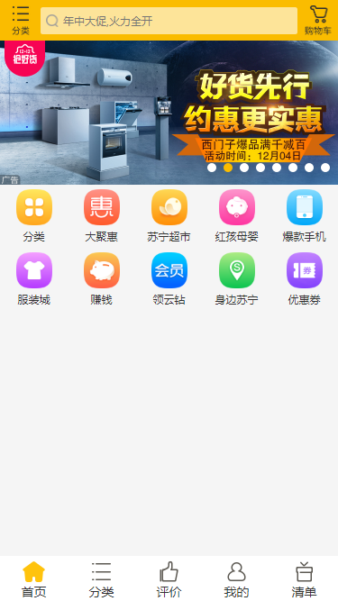
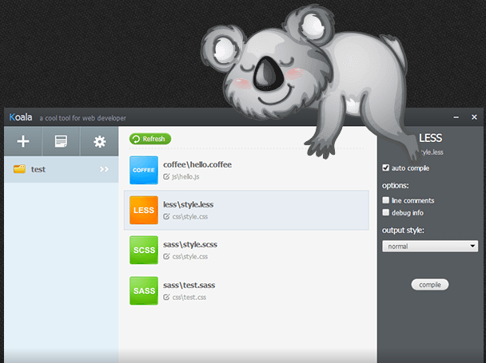

# 仿苏宁H5

## 项目截图




## 技术点

### [Swiper](https://www.swiper.com.cn/)

- **Swiper**是纯javascript打造的滑动特效插件，面向手机、平板电脑等移动终端。

- **Swiper**能实现触屏焦点图、触屏Tab切换、触屏多图切换等常用效果。

------

### **rem响应式布局**

- 一般不要给元素设置具体的宽度,但是对于一些小图标可以设定具体宽度值
- 高度值可以设置固定值,设计稿有多大,我们就严格写多大
- 所有设置的固定值都用rem做单位(首先在HTML中设置一个基准值：px和rem的对应比例,然后在效果图上获取px值,布局的时候转化为rem值)
- JS获取真实屏幕的宽度,让其除以设计稿的宽度,算出比例,把之前的基准值按照比例进行重新的设定,这样项目就可以在移动端自适应了

### [Less](http://lesscss.cn/) -- CSS 预处理语言

​	Less 是一门 CSS 预处理语言，它扩充了 CSS 语言，增加了诸如变量、混合（mixin）、函数等功能，让 CSS 更易维护、方便制作主题、扩充。

​	一般来说，客户端运行Less分为两种情况：

- 第一种方式是直接在html页面引用.less文件，然后借助less.js去编译less文件动态生成css样式而存在于当前页面，这种方式适用于开发模式。
- 第二种方式是我们首先写好.less文件的语法，然后借助工具(koala)生成对应的.css文件，然后客户端直接引用.css文件即可。比如我们常用的bootstrap.css就是通过工具编译而成，这种方式更适合运行环境。

### [koala](http://koala-app.com/index-zh.html) -- 前端预处理器编译工具

​	koala是一个前端预处理器语言图形编译工具，支持Less、Sass、Compass、CoffeeScript，帮助web开发者更高效地使用它们进行开发。跨平台运行，完美兼容windows、linux、mac。



### 预处理语言的诞生

​	现有三门CSS预处理语言：Sass、Less 、Stylus 。

#### Sass/SCSS

​	Sass 诞生于 2007 年，Ruby 编写Sass 有两种语法格式。首先是 SCSS (Sassy CSS)， 这种格式仅在 CSS3 语法的基础上进行拓展，所有 CSS3 语法在 SCSS 中都是通用的，同时加入 Sass 的特色功能。此外，SCSS 也支持大多数 CSS hacks 写法以及浏览器前缀写法 (vendor-specific syntax)，以及早期的 IE 滤镜写法。这种格式以 .scss 作为拓展名。

​	另一种也是最早的 Sass 语法格式，被称为缩进格式 (Indented Sass) 通常简称 "Sass"，是一种简化格式。它使用 “缩进” 代替 “花括号” 表示属性属于某个选择器，用 “换行” 代替 “分号” 分隔属性，很多人认为这样做比 SCSS 更容易阅读，书写也更快速。缩进格式也可以使用 Sass 的全部功能，只是与 SCSS 相比个别地方采取了不同的表达方式。

​	**sass和scss的关系**：

​	SASS版本3.0之前的后缀名为.sass，而版本3.0之后的后缀名.scss。

​	两者是有不同的，继sass之后scss的编写规范基本和css一致，sass时代是有严格的缩进规范并且没有`{}`和`；`。而scss则和css的规范是一致的。

​	*示例代码:*

​	sass:

```css
#sidebar
  width: 30%
  background-color: #faa
```

​	scss:

```css
#sidebar {
  width: 30%;
  background-color: #faa;
}
```

​	**SCSS 和 CSS 写法无差别**：

​	SCSS 和 CSS 写法无差别，这也是 Sass 后来越来越受大众喜欢原因之一。简单点说，把你现有的“.css”文件直接修改成“.scss”即可使用。

#### Stylus

​	Stylus 诞生于 2010 年，来自 Node.js 社区，语法功能也和 Sass 不相伯仲，是一门十分独特的创新型语言。

​	花括号和分号在stylus中是可以省略的，不仅如此，冒号也是可以省略的，`color: blue;` 你可以写成 `color blue`,没有问题。

​	还有 `&`，这是个新鲜东西。它是父级的引用，还是来看代码

​	stylus这样写:

```stylus
.list-item
.text-box
    &:hover
        background-color powderblue
```

​	翻译成 CSS 是这样：

```css
.list-item:hover,
.text-box:hover {
  background-color: #b0e0e6;
}
```

#### Less

​	 Less 诞生于 2009 年，受Sass的影响创建的一个开源项目。 它扩充了 CSS 语言，增加了诸如变量、混合（mixin）、函数等功能，让 CSS 更易维护、方便制作主题、扩充（*引用于官网*）。